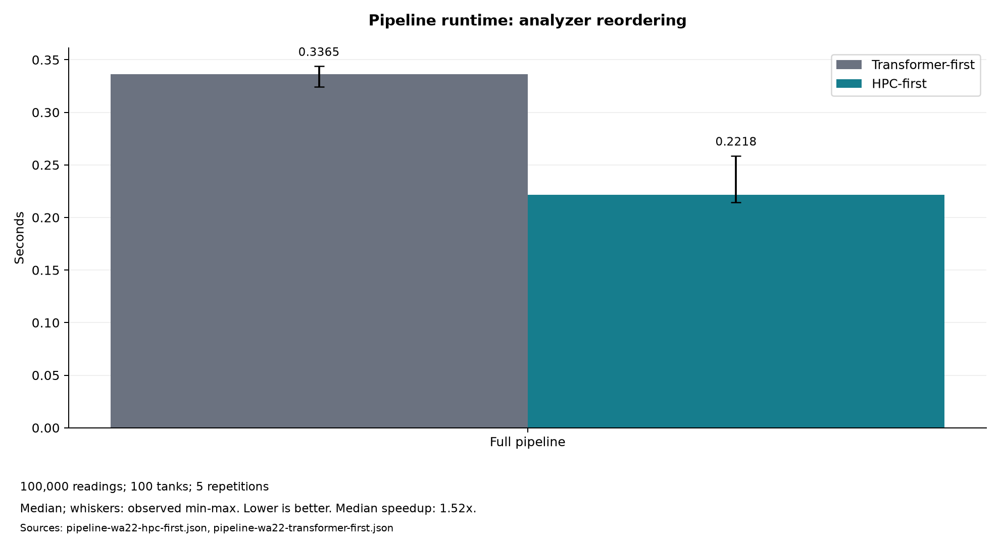

# Winery Adventures

Winery Adventures is a data analysis pipeline for ingesting, validating,
and processing readings from wine fermentation tanks.

## Main features

- reading and validating TSV datasets for sensors and tanks;
- transformations and aggregations by tank and grape variety;
- parallel computation of a stress index using Numba;
- concurrent input loading with Joblib;
- logging results to Weights & Biases (W&B);
- unit and acceptance tests, Sphinx documentation, and a reproducible
  benchmark.

## Installation

The project requires Python 3.10 or later. After creating and activating a
virtual environment, install the package and development tools from the
repository root:

```bash
python -m pip install -e ".[dev]"
```

The complete procedure for macOS, Linux, and Windows is available in the
[setup guide](docs/development-setup.md).

## Quick start

The `run_full_pipeline` function executes the entire workflow and saves the
result to a CSV file. The following example uses the sample datasets
included in the repository:

```python
from winery_adventures.main import run_full_pipeline

run_full_pipeline(
    input_csv="data/sensors_sample.tsv",
    tank_info_csv="data/tank_info_sample.tsv",
    output_csv="data/results.csv",
    project_name="WineryAdventures",
)
```

The available parameters are:

- `input_csv`: required path to the TSV containing sensor readings;
- `tank_info_csv`: optional path to the TSV containing tank information;
  the default value is `None`;
- `output_csv`: CSV destination, defaulting to `output.csv`;
- `project_name`: optional W&B project name.

The sensor column `quantity_liters` is optional and may contain null values.
Each tank's stress is computed using only readings with a present, positive
quantity, then propagated to all rows belonging to that tank. If no usable
readings exist, `stress_score` is `0.0`, indicating that no pairs can be
computed.

W&B logging runs only when `project_name` is provided, as in the example
above; when it is omitted, the pipeline only writes the CSV. For a local run
without authentication, set `WANDB_MODE=offline`. Complete examples, data
contracts, and troubleshooting instructions are provided in the
[user guide](docs/usage-guide.md).

## Repository structure

```text
Winery-Adventures/
├── winery_adventures/       # application package
│   ├── base.py               # abstract analyzer contract
│   ├── transformations.py    # transformations and aggregations
│   ├── computations.py       # HPC stress computation
│   ├── pipeline.py           # orchestration and W&B logging
│   ├── io.py                 # TSV reading and CSV writing
│   ├── validation.py         # data contract validation
│   └── main.py               # end-to-end entry point
├── benchmarks/               # time and memory benchmarks
├── tests/                    # unit and acceptance tests
├── data/                     # sample datasets
├── data_generator.py         # configurable dataset generator
└── docs/                     # project documentation
    └── diagrams/             # Draw.io source and UML exports
```

## Components

- `BaseWineryAnalyzer` defines the common `analyze_data` contract.
- `WineryTransformer` computes aggregations by tank and grape variety, and
  deviations from the standard temperature.
- `WineryHPCComputations` computes and assigns fermentation stress.
- `WineryPipeline` runs analyzers sequentially and handles W&B logging.
- The `io` module reads TSV inputs, initiates their validation, and writes
  CSV output.
- `run_full_pipeline` coordinates concurrent reading, validates tank
  coverage before running HPC on unexpanded readings, then executes the
  transformer, logging, and writing with unchanged schema and column order.

The class, sequence, and use case diagrams are described in the
[architecture documentation](docs/architecture.md).

## Verification

After installing the development dependencies, run:

```bash
ruff check .
black --check .
pytest --cov --cov-report=term-missing
sphinx-build -W --keep-going -b html docs docs/_build/html
```

The benchmark can be started with:

```bash
python -m benchmarks.benchmark_pipeline --tanks 10 --readings 1000 --repetitions 2 --seed 42
```

### Performance experiments and charts

The numerical kernel uses Numba disk caching to reuse compiled specializations
across Python processes. This reduces repeated compilation, not the work needed
to compute a result. The benchmarks distinguish warm execution from first-call
latency with an empty or populated cache.

Install plotting support with `python -m pip install -e ".[plots]"` (also included
in the development dependencies). Generate the presentation charts from recorded
evidence without running a new benchmark:

```bash
python -m benchmarks.reporting plot --production docs/benchmark-results/pipeline-wa22-hpc-first.json --legacy docs/benchmark-results/pipeline-wa22-transformer-first.json --kernels docs/benchmark-results/kernels-wa22-python-numba.json --cache docs/benchmark-results/cache-wa22.json --joblib docs/benchmark-results/joblib-wa22.json --output-dir docs/performance-plots
```



The six PNG charts cover pipeline reordering, phase timings, traced Python memory, Python versus
serial/parallel Numba, disk-cache latency, and Joblib generator scaling. They are
separate controlled experiments, not cumulative speedups. Joblib results include
both first and repeat calls and explicitly show slowdowns when parallelism costs
more than it saves.

The [benchmark report](docs/benchmark-report.md#presentation-charts-and-experiment-tracking)
explains how to collect new measurements, regenerate PNG charts with Python and Matplotlib, and optionally
import JSON reports into W&B. Local benchmarks and charts require no W&B login.
Application logging still records output statistics; benchmark logging records
performance experiments separately, after timing has finished.

## Documentation

- [User guide](docs/usage-guide.md)
- [Environment setup](docs/development-setup.md)
- [Requirements-test matrix and data contracts](docs/requirements-tests-matrix.md)
- [Architecture](docs/architecture.md)
- [Benchmark and optimization report](docs/benchmark-report.md)
- [Project management](docs/project-management.md)
- [Development phases](docs/development-phases.md)

## Project Management

Development follows the Kanban methodology in the GitHub Project
[Winery Adventures — Development](https://github.com/users/fedefranchini/projects/3).
WBS activities are represented by draft cards `WA-01`–`WA-22`; GitHub Issues
are not used as work items.

- Workflow: `Ready` → `In Progress` → `Review / Testing` → `Done`.
- WIP limit: at most one main task `In Progress` per team member.
- Branches: `feature/WA-XX-description`, `fix/WA-XX-description`, or
  `docs/WA-XX-description`.
- Pull Requests: title `WA-XX — description`, passing tests, and reciprocal
  peer review before merging.

The WBS and Definition of Done are described in the
[project management document](docs/project-management.md). Pull Requests
are available in the repository's
[Pull Requests section](https://github.com/fedefranchini/Winery-Adventures/pulls).

## Team

| Name | GitHub |
|---|---|
| Federico Marras | [@MarrasFederico](https://github.com/MarrasFederico) |
| Federico Franchini | [@FedeFranchini](https://github.com/FedeFranchini) |

## Acknowledgements

This project was developed by Federico Marras and Federico Franchini for
the Software Engineering course in 2026, as part of the degree programme
in Applied Computer Science and Data Analytics (IADA) at the University
of Cagliari.

## License

The project is distributed under the terms specified in [LICENSE](LICENSE).
