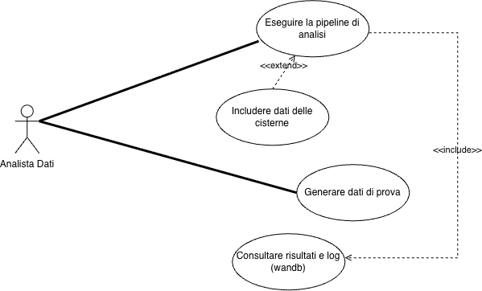

# Architettura e UML

Descrizione dei diagrammi UML che rappresentano la struttura e il
comportamento di Winery Adventures: diagramma delle classi, diagramma di
sequenza e diagramma dei casi d'uso.

## Diagramma delle classi

`BaseWineryAnalyzer` è la classe astratta che definisce il contratto comune
(`analyze_data`), implementato da `WineryTransformer` e
`WineryHPCComputations`. `WineryPipeline` compone una lista di analyzer ed
espone `run`/`log_to_wandb` per orchestrare l'esecuzione e il logging.
`pairwise_stress_function` e `run_full_pipeline` sono funzioni libere, non
classi: `pairwise_stress_function` è usata da `WineryHPCComputations` (relazione di
dipendenza), `run_full_pipeline` orchestra l'intero flusso creando ed eseguendo gli
altri componenti.

## Diagramma di sequenza

Il diagramma mostra il flusso di `run_full_pipeline`: lettura dei
file sensori e cisterne (in parallelo, tramite Joblib), creazione degli
analyzer e della pipeline, esecuzione delle trasformazioni e del calcolo HPC
(chiamate annidate all'interno di `WineryPipeline.run`), logging su wandb e
scrittura del risultato finale.

## Diagramma dei casi d'uso

L'attore **Analista Dati** può eseguire la pipeline di analisi (caso d'uso
principale) ed eventualmente includere i dati delle cisterne come estensione opzionale.
Indipendentemente, può anche generare dataset di prova tramite il generatore
dati.