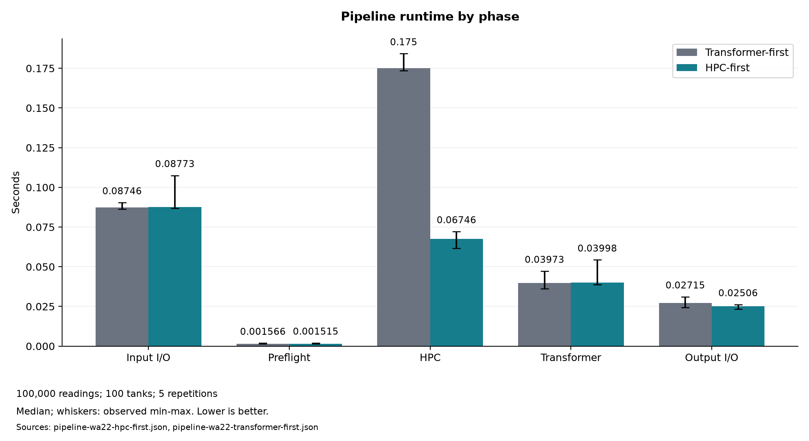
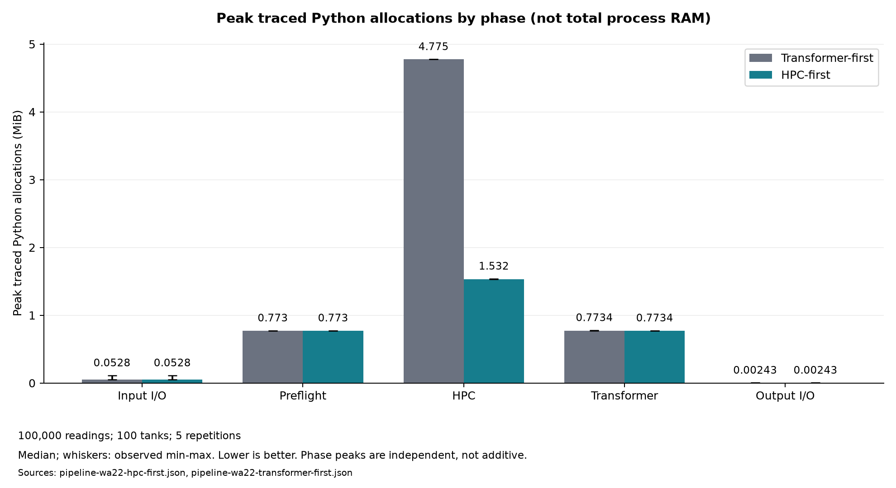
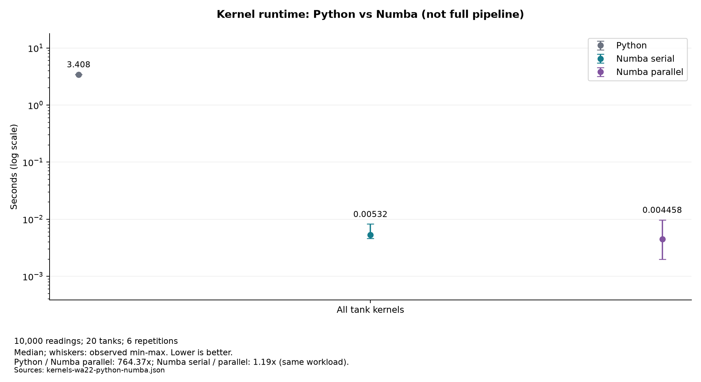
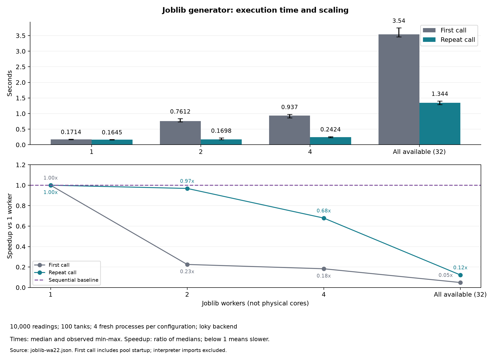
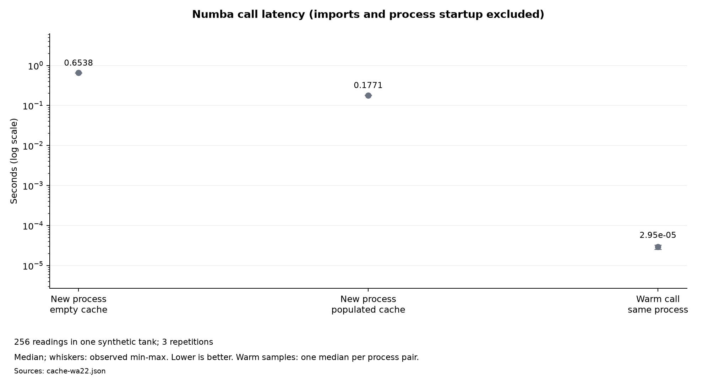

# WA-18 / WA-19 — Benchmark and optimization report

This report presents the benchmark results for the Winery Adventures
pipeline, evaluating the effect of the analyzer execution reordering
(WA-19: HPC computation before variety expansion) and isolating the
performance impact of Numba's parallel compilation (WA-18). The
`hpc-first`, `transformer-first`, and kernel measurements in this report
were produced on September 7, 2026.

The raw measurement data is recorded in the following JSON files:

- Production order (`hpc-first`): [pipeline-wa22-hpc-first.json](benchmark-results/pipeline-wa22-hpc-first.json)
- Legacy order (`transformer-first`): [pipeline-wa22-transformer-first.json](benchmark-results/pipeline-wa22-transformer-first.json)
- Kernel comparison (`hpc-first`): [kernels-wa22-hpc-first.json](benchmark-results/kernels-wa22-hpc-first.json)
- Historical pre-reorder baseline: [pipeline-wa22.json](benchmark-results/pipeline-wa22.json) and [kernels-wa22.json](benchmark-results/kernels-wa22.json)

## Version and environment

The measured version is the working tree of
`fix/WA-22-final-verification`, on top of commit
`d8c4b82b5c1ba6dd3b8f926db2743215db4748a1` (`d8c4b82`), with local WA-22
changes. The base commit alone does not identify the measured code: the
benchmark and kernel comparison JSON files record the SHA-256
fingerprints of the sources involved so that the measured code remains
identifiable despite uncommitted changes in the working tree. The
fingerprints are of local bytes, so they include line endings.

These three September 7 JSONs are preserved measurements of the pre-cache
implementation, not measurements of every subsequent checkout. Enabling Numba
disk caching and extending benchmark metadata changes the source fingerprints;
the original hashes and numbers have not been replaced. Their warmed timing
comparisons remain historical evidence. New measurements must use new filenames
and retain their own source hashes. The separate cache experiment below measures
first-call latency rather than reusing these warmed timings.

| Item | Value |
|---|---|
| System | Windows-10-10.0.26200-SP0 |
| Processor | AMD64 Family 25 Model 33 Stepping 2, AuthenticAMD |
| Numba threads | 32 |
| Python | 3.11.0 |
| NumPy / Polars | 2.4.6 / 1.44.1 |
| Numba / Joblib | 0.67.0 / 1.5.3 |
| Input | 100 tanks, 100,000 readings, seed 42 |
| Output | 300,000 rows after per-variety expansion |
| Computable unexpanded rows (`hpc-first`) | 90,041 complete readings evaluated |
| Computable expanded rows (`transformer-first`) | 270,123 expanded rows evaluated |
| Repetitions | 5 per measurement |

All benchmark runs produced identical deterministic inputs:

- sensors: `fdd4518535ce9dd98c4e034cb1f9ae5464771549ed7c7433bd10b8384d80d557`;
- tanks: `27b9dfe8c3ddf683a6b19499b3fbca38b158059b36e9dfdb96e5933cd37d0de4`.

## Reproduction

Run from the root, after installing the project. The destination
directory must exist. The following commands create new local reports:

```bash
python -m benchmarks.benchmark_pipeline --tanks 100 --readings 100000 --repetitions 5 --seed 42 --order hpc-first --output pipeline-hpc-first-new.json
python -m benchmarks.benchmark_pipeline --tanks 100 --readings 100000 --repetitions 5 --seed 42 --order transformer-first --output pipeline-transformer-first-new.json
python -m benchmarks.compare_kernels --tanks 100 --readings 100000 --repetitions 5 --seed 42 --output kernels-new.json
```

Compare hashes, parameters, versions, and thread count before comparing
timings. The attached JSON files keep every repetition, not just the
median. Absolute timings vary with the machine, the load, and the run
conditions; the observed ratios are not guarantees for other
installations.

## Production pipeline (`hpc-first`)

The runner measures TSV reading, preflight tank-coverage validation,
transformations, HPC, and CSV writing. Input generation and initial
compilation are excluded from the iterations; W&B is not activated by the
benchmark. Score finiteness is verified at every iteration.

Reading includes type inference over the entire TSV, needed to recognize
quantities and decimals even when they appear beyond the first rows. The
flow includes the preflight validation check (`validate_tank_coverage`)
performed immediately after loading. The following timings include these
costs; they do not reuse the measurements from before the runner fix.

| Measure | Median | Minimum | Maximum |
|---|---:|---:|---:|
| Total | 0.221799 s | 0.214286 s | 0.258613 s |
| Input reading | 0.087726 s | 0.086735 s | 0.107534 s |
| Preflight validation | 0.001515 s | 0.001354 s | 0.002023 s |
| Transformations | 0.039976 s | 0.038753 s | 0.054334 s |
| HPC | 0.067462 s | 0.061745 s | 0.072189 s |
| Output writing | 0.025063 s | 0.023248 s | 0.026205 s |

Phase medians are not necessarily additive. The total also includes
coordination and result checking. Every iteration produced 300,000 rows
with finite stress values.

| Phase | Peak of traced Python allocations |
|---|---:|
| Input reading | 0.111 MiB |
| Preflight validation | 0.773 MiB |
| Transformations | 0.773 MiB |
| HPC | 1.538 MiB |
| Output writing | 0.002 MiB |

`tracemalloc` does not measure the process's entire memory and does not
include all the native allocations of Polars, NumPy, and Numba. These
values cannot be used as an estimate of the required RAM.

## Reordering effect (WA-19 before/after comparison)

The WA-19 optimization reorders the analyzers so that the quadratic
pairwise stress computation runs on unexpanded sensor readings before
grape variety expansion, rather than after.

Both execution orders were measured in the same session on the same
machine and the same seed 42 dataset (5 repetitions):

| Measure | Legacy (`transformer-first`) | Production (`hpc-first`) | Speedup / Ratio |
|---|---:|---:|---:|
| Total runtime (median) | 0.336496 s | 0.221799 s | 1.52× (34.1% less time) |
| Total runtime (min) | 0.324103 s | 0.214286 s | 1.51× |
| Total runtime (max) | 0.343845 s | 0.258613 s | 1.33× |
| Input reading (median) | 0.087457 s | 0.087726 s | 1.00× |
| Preflight validation (median) | 0.001566 s | 0.001515 s | 1.03× |
| Transformations (median) | 0.039730 s | 0.039976 s | 0.99× |
| HPC computation (median) | 0.174963 s | 0.067462 s | 2.59× (61.4% less time) |
| Output writing (median) | 0.027151 s | 0.025063 s | 1.08× |
| HPC peak Python memory | 4.776 MiB | 1.538 MiB | 3.11× reduction |

### Rationale and numerical verification

In the legacy order (`transformer-first`), each sensor reading is
expanded into multiple rows based on the grape varieties assigned to its
tank (an average factor of about 3 in the standard benchmark dataset,
expanding 90,041 computable readings to 270,123 rows). Because the
pairwise stress kernel has quadratic complexity relative to the number
of readings per tank, expanding each reading by a factor of about 3
multiplies the number of pairwise evaluations per tank by about 9, while
the n squared normalization denominator grows by the same factor, so the
tank stress score is mathematically unchanged.

Reordering to `hpc-first` computes the pairwise stress scores directly on
the 90,041 unexpanded valid readings, and the transformer subsequently
broadcasts the resulting score to each variety row. This reduces the
median HPC execution time from 0.174963 s to 0.067462 s (a **2.59×
speedup**) and reduces peak traced memory from 4.776 MiB to 1.538 MiB
(**3.11× reduction**). The measured wall-clock HPC gain is 2.59× rather
than 9× because the kernel is executed in parallel across 32 Numba
threads and other per-phase costs remain.

For the finite outputs exercised by the regression tests, reordering
preserves stress values within floating-point tolerance, not bit for bit.
Extreme inputs can overflow the longer legacy accumulation even when
the unexpanded computation remains finite. The regression tests are:

- `tests/unit/test_main.py::test_run_full_pipeline_reordered_vs_reference_and_legacy_order`
- `tests/unit/test_pipeline.py::test_legacy_explicitly_ordered_pipeline_usable`

## Controlled serial/parallel comparison

`benchmarks.compare_kernels` compiles the current formula body with
`parallel=False` and compares it with the application kernel's
`parallel=True` on the unexpanded sensor readings (90,041 complete
readings across 100 tanks). In the serial variant, `prange` runs as a
regular serial loop. The null-quantity filter, the groups, and the
arrays are identical: only the compilation mode changes.

The warm-up uses the actual arrays before the measurements. The order of
the two variants is alternated across repetitions. The time includes the
calls for every tank and the collection of the scores, excluding data
preparation, compilation, numeric verification, and `tracemalloc`.

| Variant | Median |
|---|---:|
| Serial | 0.122712 s |
| Parallel | 0.013351 s |
| Serial/parallel ratio | 9.19× |

The maximum absolute difference observed is `6.1995e-13`. Every
repetition verifies equivalence with `rtol=1e-10` and `atol=1e-10`.

This comparison measures the effect of parallelism with the same
algorithm and usable data. It does not represent the full execution of
an old commit.

## Historical pre-reorder baseline (Reference evidence)

Earlier measurements from September 6, 2026, obtained prior to the
analyzer reordering, are retained in
[pipeline-wa22.json](benchmark-results/pipeline-wa22.json) and
[kernels-wa22.json](benchmark-results/kernels-wa22.json) as historical
baseline evidence.

Those historical runs measured the working tree of the branch based on
commit `bce9f3d1bd151a995916cec0e6c8b34097ac101d`, with local
uncommitted WA-22 changes. The recorded source fingerprints in those JSON
files predate the English translation of comments, docstrings, and
descriptive text; they do not match the current source files. While the
stress formula and generated datasets are unchanged, the analyzer
orchestration order and the benchmark runners are not.

| Metric | Pre-reorder baseline value |
|---|---:|
| Usable rows evaluated in HPC | 270,123 (after expansion) |
| Pipeline total runtime (median) | 0.425713 s |
| Pipeline HPC phase runtime (median) | 0.245746 s |
| Pipeline HPC peak Python memory | 4.776 MiB |
| Kernel serial runtime (median) | 1.138219 s |
| Kernel parallel runtime (median) | 0.127068 s |
| Kernel serial/parallel ratio | 8.96× |

## Interpretation and possible optimizations

With the WA-19 analyzer reordering, the HPC computation is no longer the
overwhelming bottleneck of the pipeline at the verified size (dropping
from the legacy 0.175 s median down to 0.067 s in the same measurement
session, now faster than the 0.088 s input reading phase). Parallelism
in Numba provides a 9.19× kernel speedup on this 32-thread machine.

Symmetry could enable further optimizations for ordinary quantities: the
contribution of pair `(i, j)` matches that of `(j, i)`, and self-pairs
evaluate to zero. However, validation accepts any finite strictly
positive quantity, including extreme subnormal values such as `1e-320`
for which `500.0` divided by the quantity evaluates to infinity. The
self-pair term is then `0.0` multiplied by infinity, yielding `NaN`
rather than zero. In the current full double loop that `NaN` propagates
and the analyzer correctly rejects the dataset with
`DataValidationError`, whereas summing only the pairs `i < j` and
doubling would skip the diagonal entirely and return zero for a
single-reading input. Because skipping the diagonal would change
observable behavior on extreme subnormal quantities, this variant is
deliberately not implemented rather than merely unmeasured.

Distributing the tanks would also require dedicated measurements:
copies, coordination cost, and contention with the Numba threads could
affect the result. The report does not attribute gains to unmeasured
optimizations.

## Presentation charts and experiment tracking

### Reproduce the charts

Install `python -m pip install -e ".[plots]"`, or use the development extra.
Run from the repository root:

```bash
python -m benchmarks.reporting plot --production docs/benchmark-results/pipeline-wa22-hpc-first.json --legacy docs/benchmark-results/pipeline-wa22-transformer-first.json --kernels docs/benchmark-results/kernels-wa22-python-numba.json --cache docs/benchmark-results/cache-wa22.json --joblib docs/benchmark-results/joblib-wa22.json --output-dir docs/performance-plots
```

Omit both `--cache` and `--joblib` to generate only the four pipeline/kernel charts. The Python
module uses Matplotlib and produces only PNG images for slides and Markdown, not
HTML pages or SVG files. The command
regenerates same-named images but does not modify the input JSONs or run benchmarks.
All labels and values derive from the raw repetitions, not manually entered
speedups or cached summary fields. Whiskers show observed minimum and maximum,
not confidence intervals. Independent phase medians are not summed into a total.
Kernel and cache comparisons use markers with vertical ranges on logarithmic
axes, not bars measured from an undefined zero. Pipeline and Joblib time charts
and the memory chart retain bars on linear axes. Plotting does not import W&B;
the SDK is loaded only when an upload is explicitly requested.

The pipeline before/after chart rejects different input hashes, workload sizes,
environments, recorded source hashes, and output row counts. It does not require
historical hashes to match today's checkout: it is plotting recorded experiments.
The kernel, cache, and Joblib charts represent separate experiments, not successive steps
in a single cumulative speedup.






The memory chart reuses the existing `python_peak_mib` samples. It shows the
median peak of traced Python allocations in each phase, with observed min/max,
not total process RAM or all native allocations. For HPC, the median per-run
peaks are 4.775 and 1.532 MiB; the maximum observed peaks reported earlier are
4.776 and 1.538 MiB. Peaks are measured separately per phase
and must not be summed into a pipeline peak.



The three pipeline charts use the September 7 measurements (100 tanks, 100,000
readings, seed 42, five repetitions). The updated kernel chart uses a separate,
smaller workload including Python, described below. None measures current
end-to-end startup time. The original two-variant kernel JSON is retained;
passing `--kernels docs/benchmark-results/kernels-wa22-hpc-first.json` reproduces
its serial/parallel chart instead.

### Python versus Numba

```bash
python -m benchmarks.compare_kernels --tanks 20 --readings 10000 --repetitions 6 --seed 42 --include-python --output kernels-new.json
```

The [three-variant report](benchmark-results/kernels-wa22-python-numba.json)
times the undecorated production body (`pairwise_stress_function.py_func`),
Numba with `parallel=False`, and the production parallel Numba specialization.
The Python variant runs ordinary interpreted loops over the same NumPy arrays;
it is not a vectorized NumPy baseline. Each variant computes the same full
ordered-pair formula, including the diagonal and the same null-quantity filter.
All outputs are checked with `rtol=atol=1e-10`; non-finite scores fail the run.

Compilation/cache loading and data preparation are excluded. All variants have
an untimed validation pass, followed by a rotating execution order across
repetitions. Six repetitions place each variant twice in each position.
The smaller workload keeps interpreted Python practical: experiments with more
than five million valid ordered pairs are rejected before running the kernels.
The limit uses actual per-tank pair counts, not just the total row count.

The chart uses a logarithmic seconds axis, median markers and observed min/max.
The caption separates Python/Numba parallel from Numba serial/parallel ratios,
both calculated from this experiment's raw samples. Python
versus serial Numba isolates compilation; serial versus parallel Numba isolates
parallel execution. A speedup applies only to this kernel and workload, not the
complete pipeline. Do not compare its timings directly with the larger historical
100,000-reading experiment or extrapolate another project's acceleration factor.
Without `--include-python`, the existing two-variant benchmark remains available.

Recorded on September 10 with Python 3.11 on Windows and 32 Numba threads:

| Variant | Median runtime | Speedup vs Python |
|---|---:|---:|
| Python | 3.407757 s | 1.00x |
| Numba serial | 0.005320 s | 640.56x |
| Numba parallel | 0.004458 s | 764.37x |

The workload contains 9,023 valid readings and 4,078,425 ordered pairs across
20 tanks. Parallel versus serial Numba is only 1.19x by median in this smaller
experiment, with overlapping observed timing ranges; this is not evidence of a
consistent per-call improvement. The large compilation benefit must not be
confused with the more variable benefit of parallel scheduling. The historical
9.19x serial/parallel result used a different, larger workload.

### Joblib generator scaling

```bash
python -m benchmarks.compare_joblib --tanks 100 --readings 10000 --repetitions 4 --seed 42 --jobs 1 2 4 -1 --output joblib-new.json
```

The [Joblib report](benchmark-results/joblib-wa22.json) measures the actual
`generate_sensor_data` function with 1, 2, 4 and all available workers. Its new
keyword-only options, `n_jobs` and `show_progress`, leave the default behavior
unchanged (`-1` and `True`). No dataset files are altered by this experiment.

Each configuration and repetition gets a fresh Python interpreter. The first
generator call includes worker-pool startup; a second call in the same process
can reuse the loky executor. With one worker both calls are sequential, with no
pool. Both include seed generation, task dispatch, row generation, serialization
and collection. Interpreter startup, imports, correctness hashing, and file I/O
are excluded. Each call resets seed 42, and ordered records must match the
sequential reference exactly, including missing quantities. SHA-256 fingerprints
and row counts are recorded for every call.

The experiment selects the `loky` process backend, uses automatic Joblib batching,
disables progress bars, and limits native threads inside each worker to one.
Worker count is not physical core count; the report records how `-1` resolves on
the measuring machine. Four repetitions rotate all four configurations through
every position. First/repeat timings remain separate: their difference is not a
pure measurement of pool-startup overhead.



The top panel shows median times with observed min/max; the bottom shows ratios
of medians against the one-worker baseline for the corresponding first/repeat
category. The dashed 1x line separates acceleration from slowdown. Ratios below
one are retained, not hidden: small row-generation tasks can cost more to
distribute than to execute sequentially. Results depend on workload, OS and CPU.
This experiment does not measure the pipeline's threaded I/O, which has at most
two independent file-reading tasks, or Numba's separate threading implementation.

Recorded on September 10 with Python 3.11 on Windows; `-1` resolved to 32 workers:

| Workers | First call median | Repeat call median | Repeat-call speedup vs 1 |
|---|---:|---:|---:|
| 1 | 0.171388 s | 0.164488 s | 1.00x |
| 2 | 0.761228 s | 0.169845 s | 0.97x |
| 4 | 0.936975 s | 0.242369 s | 0.68x |
| 32 (`-1`) | 3.540320 s | 1.344314 s | 0.12x |

No parallel configuration has a better median than sequential generation in
this 10,000-record experiment. Two warmed workers are close to sequential time;
their observed ranges overlap. These results support discussing parallelization
overhead, not claiming that all CPUs always improve performance or attributing
the whole difference to startup alone. The generator's default is retained;
choosing a different default requires measurements for the intended workload.

Run benchmarks without concurrent tests or other compute-heavy work. Save new
results to new filenames: both comparison commands refuse existing outputs.
Source fingerprints identify the measured files even when HEAD has local changes.

### Numba cache experiment

The production decorator is `@njit(parallel=True, cache=True)`. Numba stores
compiled specializations, not input data or computed stress scores. Calls with
the same supported signature reuse compiled code in memory; compatible future
processes may also reuse disk artifacts. Different argument types can require
new specializations. Cache files normally live under ignored `__pycache__`
directories and must not be committed.

```bash
python -m benchmarks.compare_cache --size 256 --repetitions 3 --warm-calls 5 --output cache-new.json
```

For each repetition, the experiment creates an empty temporary cache, starts
one Python process to compile the actual production kernel, then starts another
process with that populated cache. Observed Numba cache misses/hits verify the
mechanism. Both processes also repeat warmed calls and check results against an
independent full ordered-pair NumPy formula. The temporary cache is then removed;
existing application caches are left alone. Existing output JSONs are rejected.

The three categories are **first call with empty cache**, **first call with
populated cache**, and **warm call in the same process**. Timings exclude Python
startup, imports, input construction, and correctness checks. The first category
includes compilation/cache writing, while the second includes cache loading and
runtime initialization: neither is pure compilation time. Warm samples are one
median per cached worker; the raw inner calls are retained in the JSON.



The [recorded cache experiment](benchmark-results/cache-wa22.json) provides the
source fingerprints, environment, raw calls, and cache-hit evidence behind this
chart. Its logarithmic axis makes the different latency scales visible. Cache
benefits concern repeated starts, not a reduction in the formula's quadratic
work. Existing warm pipeline/kernel benchmarks still warm up before timing.

Numba's cache has limitations when imported functions or global constants change;
use isolated caches when comparing revisions. See the
[Numba caching documentation](https://numba.readthedocs.io/en/stable/developer/caching.html).

### Optional W&B import

Application W&B logging remains unchanged: it sends row/tank counts and stress
statistics after analysis. Benchmark tracking is a separate explicit operation
on existing JSON files. Measurement and local charts require no W&B connection.

| Entry point | When W&B is used | Recorded information |
|---|---|---|
| `run_full_pipeline(..., project_name="...")` | After the analyzers finish; omitted `project_name` disables application W&B logging. | Output rows, tank count, stress count, mean, minimum, and maximum. |
| `benchmarks.reporting upload ...` | Only when the import command is explicitly invoked, after measurement has finished. | Benchmark configuration, repetitions, summary metrics, provenance, and original JSON artifact. |

The low-level `WineryPipeline.run(..., log_to_wandb=True)` API can also explicitly
enable application logging without a project name. Application run handling and
benchmark importing are independent; importing creates a new run without reusing
or closing another active run.

After `wandb login`, import comparable pipeline runs into a chosen W&B project:

```bash
python -m benchmarks.reporting upload docs/benchmark-results/pipeline-wa22-transformer-first.json docs/benchmark-results/pipeline-wa22-hpc-first.json --project winery-performance --group pipeline-order-sep07
python -m benchmarks.reporting upload docs/benchmark-results/kernels-wa22-hpc-first.json --project winery-performance --group kernel-parallelism-sep07
python -m benchmarks.reporting upload docs/benchmark-results/kernels-wa22-python-numba.json --project winery-performance --group python-numba-comparison
python -m benchmarks.reporting upload docs/benchmark-results/joblib-wa22.json --project winery-performance --group joblib-generator-scaling
python -m benchmarks.reporting upload docs/benchmark-results/cache-wa22.json --project winery-performance --group cache-latency
```

Optionally pass `--entity YOUR_WANDB_ACCOUNT_OR_TEAM`; this is a W&B namespace,
not necessarily the GitHub project owner. To record locally without uploading,
pass `--mode offline`; later use `wandb sync PATH_TO_OFFLINE_RUN` to synchronize
the selected local run. Each import creates a new run, including repeated imports
of the same file. Match `config.report_sha256` to recognize duplicates.

The importer logs:

- configuration: measured environment, parameters, dataset/source hashes, and
  measurement timestamp when recorded (older reports explicitly say unavailable);
- history: one step per repetition, containing timing and traced-memory metrics;
- summary: median/min/max, correctness flags, and numerical error when available;
- artifact: the original, unchanged JSON, preserving raw evidence and methodology.

Automatic Git attribution is disabled for imports: the importing checkout may
not be the measured code. Use `config.measurement_environment.git_revision` and
`config.measurement_sources` to identify that code; the Git revision alone may
represent a base commit with local changes. Import time is not measurement time.

In W&B, compare `total_seconds_median` or `hpc_seconds_median` across the two
pipeline runs using a bar panel. Compare `serial_seconds_median` and
`parallel_seconds_median` for the kernel experiment, or `cold_seconds_median`,
`cached_seconds_median`, and `warm_seconds_median` for the cache experiment.
Repetition history describes timing variability, not progressive code improvements.

For the three-variant experiment, `python_seconds_median`, `serial_seconds_median`
and `parallel_seconds_median` are accompanied by `serial_vs_python_speedup`,
`parallel_vs_python_speedup`, and `parallel_vs_serial_speedup` summaries. Joblib
uses `cold_1_seconds_median`, `warm_1_seconds_median`, and equivalent metrics for
2, 4 and -1 workers, plus `cold_2_speedup`, `warm_2_speedup`, etc. These ratios
are recomputed from raw samples. Its correctness flag is `outputs_match`, not
`scores_finite`, because it compares generated records rather than stress scores.

To inspect an experiment in the W&B web interface:

1. Open the project passed with `--project` and filter runs by the chosen group.
2. Inspect each run's configuration to identify the measured parameters, code,
   and input hashes. A run represents an imported report, not a Git commit by itself.
3. Add a bar panel for the appropriate summary metric, such as
   `total_seconds_median`, and compare the relevant runs. Do not mix full-pipeline
   times, kernel-only times, and first-call cache latency in one speedup comparison.
4. Inspect repetition history for variability; download the JSON from the run's
   artifacts to recover all original measurements and cache-hit evidence.
5. For a later implementation, save a new benchmark JSON and import it as another
   run. Reuse an experiment group only when the configurations are comparable;
   keep the old runs and reports instead of replacing their numbers.

The W&B dashboard is an optional external viewer. The six local presentation
charts are still generated entirely by Python, without W&B or a browser. HTML
under `docs/_build/html` comes from the separate Sphinx documentation build and
is ignored by Git; it is not chart output and is not needed to use the PNGs.

Upload occurs only after measurement and cannot affect recorded timings. Invalid
or failed benchmark reports are rejected before a run opens; W&B failures
propagate and do not overwrite local evidence. This importer handles successful
benchmark JSONs, not automatic profiling, historical-commit execution, or capture
of failed benchmark processes. Debugging still relies on tests and tracebacks.
See [W&B Experiments](https://docs.wandb.ai/models/track) and
[Artifacts](https://docs.wandb.ai/models/artifacts).
